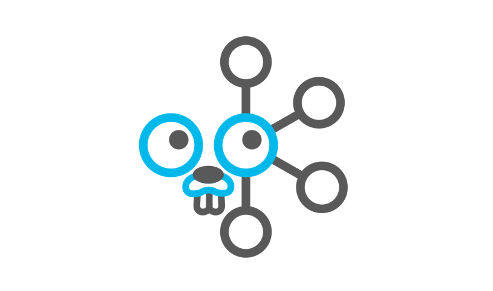

# Golang Kafka Example

>Sample Golang Kafka Consumer and Producer

[![Go Version][go-version-image]][go-version-url]
[![License][license-image]][license-url]
[](http://makeapullrequest.com)
[](https://goreportcard.com/badge/github.com/vsouza/go-kafka-example)


## Setup

[Apache Kafka Quickstart](https://kafka.apache.org/quickstart)

__Producer__

`go run cmd/producer/main.go`


__Consumer__

flags:
 
  * brokerList
  * topic
  * partition (default: 0)
  * offsetType
  * messageCountStart (default: 0)

`go run cmd/consumer/main.go`

```
Received messages  Something Cool #1
Received messages  Something Cool #2
Received messages  Something Cool #3
Received messages  Something Cool #4
Received messages  Something Cool #5
```

## Contribute

We would love you for the contribution to **go-kafka-example**, check the ``LICENSE`` file for more info.

## Meta

Vinicius Souza – [@iamvsouza](https://twitter.com/iamvsouza) – hi@vsouza.com

Distributed under the MIT license. See ``LICENSE`` for more information.

[https://github.com/vsouza/go-kafka-example](https://github.com/vsouza/go-kafka-example)

[go-version-image]:https://img.shields.io/badge/Go%20version-1.7-blue.svg
[go-version-url]: https://golang.org/
[license-image]: https://img.shields.io/badge/License-MIT-blue.svg
[license-url]: LICENSE
